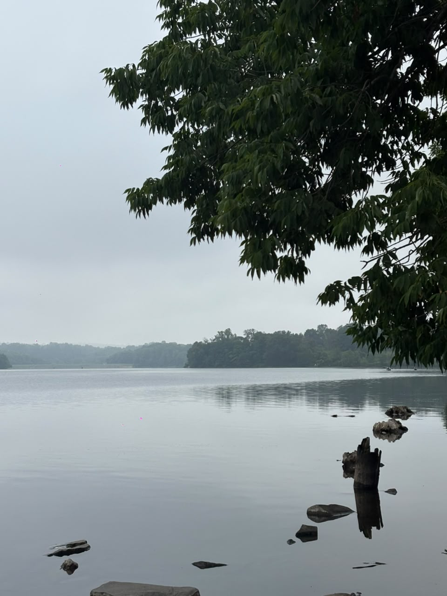
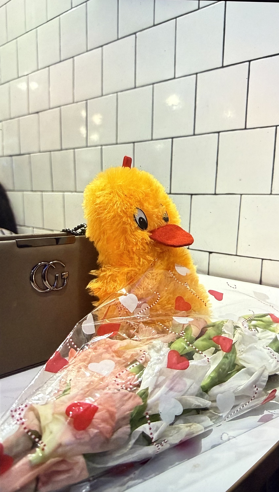
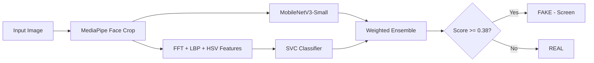

# Spot the Fake Photo — SalesCode AI Take-Home

Given **one image**, decide if it is a **real photo** or a **photo of a screen** (phone/laptop/printout recapture).

```powershell
python predict.py some_image.jpg
# Output: 0.0740   (single number 0–1)
```

| Score | Meaning |
|-------|---------|
| **0** | Real / genuine photo |
| **1** | Photo of a screen (fraud) |
| **≥ 0.38** | Flagged as fake |

---

## Example images (from our phone dataset)

| Real scenery (phone) | Screen recapture (phone) |
|:---:|:---:|
|  |  |

---

## Results on our dataset

Trained on **phone-captured** images only:

| Folder | Images | Content |
|--------|--------|---------|
| `real/` | 74 | Faces, scenery, objects, room photos |
| `screen/` | 78 | Photos of phone/laptop screens showing pictures |

```text
Accuracy:  95.39%
Real:      92% recall (68/74)
Screen:    99% recall (77/78)
Threshold: 0.38
```

Run evaluation yourself:

```powershell
python evaluate.py
```

---

## How it works



1. **MediaPipe** — crops face region (falls back to center crop for scenery)
2. **Physics features** — FFT Moiré peaks, LBP texture, Laplacian, HSV color
3. **MobileNetV3** — fine-tuned CNN on phone photos
4. **SVC + ensemble** — combines models weighted by validation accuracy
5. **Augmentation** — flip, rotate, brightness (training only)

---

## Project structure

```
salescode/
├── predict.py              # Main interface (required by assignment)
├── app.py                  # Live webcam demo
├── train_all.py            # Train both models
├── train_model.py          # Feature + SVC training
├── train_mobilenet.py      # MobileNetV3 training
├── evaluate.py             # Test accuracy on real/ + screen/
├── add_sample.py           # Add new photos and retrain
├── preprocess.py           # MediaPipe face crop + image loading
├── features.py             # FFT / LBP / HSV extraction
├── augmentation.py         # Training augmentation
├── heuristics.py           # Rule-based screen signals
├── model_loader.py         # Unified prediction
├── model_registry.py       # Threshold config
├── requirements.txt
├── templates/index.html    # Web UI
├── real/                   # Genuine phone photos
├── screen/                 # Screen recapture phone photos
├── mobilenet_liveness.pt   # Trained CNN weights
├── model_sklearn.joblib    # Trained SVC pipeline
└── model_config.json       # Threshold + metrics
```

---

## Setup

```powershell
cd salescode
pip install -r requirements.txt
```

**Requirements:** Python 3.10+, ~2 GB disk (PyTorch + MediaPipe).

---

## Train on your photos

Put images in two folders:

| Folder | What to put |
|--------|-------------|
| `real/` | Normal photos of real things |
| `screen/` | Photos of a screen or printout showing a picture |

Supported formats: `.jpg`, `.jpeg`, `.png`, `.heic` (uses `.jpg` if both exist).

```powershell
python train_all.py
```

Or add single images and retrain:

```powershell
python add_sample.py real path\to\photo.jpg
python add_sample.py fake path\to\screen_photo.jpg
```

---

## Usage

### CLI (required for submission)

```powershell
python predict.py real\WhatsApp Image 2026-06-30 at 20.13.02.jpeg
# 0.0274  → REAL

python predict.py screen\IMG_8852.jpeg
# 0.9xxx  → FAKE
```

### Web demo (optional)

```powershell
python app.py
```

Open **http://127.0.0.1:5000** — use camera or upload an image.

Restart `app.py` after retraining (`Ctrl+C` then `python app.py`).

### Evaluate all images

```powershell
python evaluate.py
```

---

## Submission note (for SalesCode)

### Approach

Hybrid detector: **MediaPipe face crop** → **FFT Moiré analysis** + **LBP texture** + **SVC classifier**, combined with **MobileNetV3-Small** in a weighted ensemble. Trained on ~150 phone photos (faces + scenery + screen recaptures).

### Accuracy (honest)

| Metric | Value |
|--------|-------|
| Full dataset (152 images) | **95.39%** |
| Real recall | 92% |
| Screen recall | 99% |
| Holdout validation (SVC) | ~81% |

Company held-out accuracy may differ if their attacks look different from our training photos.

### Latency

| Device | Time per image |
|--------|----------------|
| Laptop CPU (warm) | **~140 ms** (ensemble) |
| First run (model load) | ~270 ms |

### Cost per image

| Deployment | Cost |
|------------|------|
| **On-device (phone)** | **$0** — runs offline |
| Cloud VPS | ~$0.00005/image (~$50 per million) |

### What I'd improve with more time

- More screen variety (tablets, printouts, different monitors)
- Quantize MobileNet to INT8 for &lt;30 ms on mobile
- Active learning from production false positives

### Fraud threshold

**0.38** — tuned to catch screen recaptures while keeping real false-rejects low. For production, tune on a labeled validation set from real traffic.

---

## Troubleshooting

| Problem | Fix |
|---------|-----|
| `Could not read image` | Use full path; only `.jpg`/`.jpeg`/`.png` |
| Fake marked as real | Add similar fakes to `screen/`, run `train_all.py` |
| Real marked as fake | Add similar reals to `real/`, run `train_all.py` |
| Old results in web app | Restart `python app.py` after retraining |
| `.mp4` in folders | Remove — only images are used |

---

## Quick start

```powershell
pip install -r requirements.txt
python train_all.py
python evaluate.py
python predict.py real\your_photo.jpg
python app.py
```

**Score guide:** `0` = real · `1` = screen fake · threshold = **0.38**
