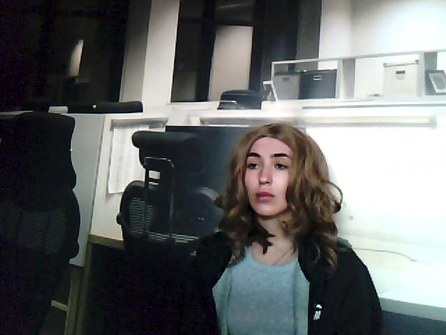
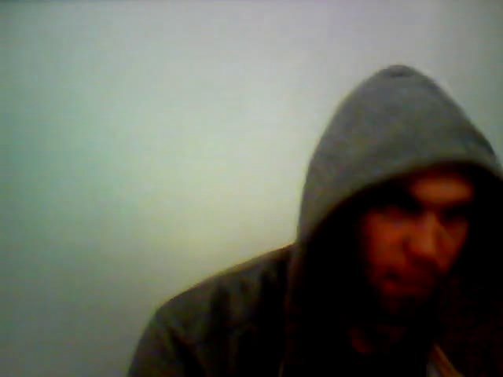
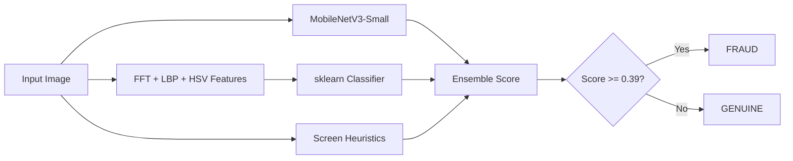

# Screen Recapture Liveness Detector

Detect whether a photo is **genuine** (taken live) or a **screen recapture / spoof** (photo of a phone, monitor, or printed display). Built for fast, on-device fraud checks using **MobileNetV3**, handcrafted physics features (FFT Moiré, LBP texture), and an ensemble classifier.

---

## What it does

| Input | Output |
|-------|--------|
| Any JPG / PNG image | Score **0.0 → 1.0** |
| Score **below 0.39** | **GENUINE** — real photo |
| Score **0.39 and above** | **FRAUD** — screen recapture |

---

## SalesCode assignment — correct dataset

The company brief says: **use your phone** and collect:

| Folder | Required content | Count |
|--------|------------------|-------|
| `real/` | Normal photos of **real things** (face, room, objects) | **~50** |
| `screen/` | Photos of a **phone/laptop screen or printout** showing a picture | **~50** |

### What you have now (needs fixing for submission)

| Source | `real/` | `screen/` | Match assignment? |
|--------|---------|-----------|-------------------|
| `im_*` from `download_and_generate.py` | 50 web stock photos | 50 **computer-faked** screens | Partial — not phone captures |
| `hf_*` from `download_real_faces.py` | 90 live webcam faces | 90 monitor replays | Good supplement, not your phone |

**For the company held-out test (95%+ target):** add **your own phone photos** before submitting.

### Phone capture checklist (~30–60 min)

**`real/` — ~50 photos**
- Your face, friends, room, desk, objects
- Different lighting (indoor, outdoor, bright, dim)
- Different angles

**`screen/` — ~50 photos**
- Photo of **phone screen** showing someone’s picture
- Photo of **laptop monitor** showing an image
- Optional: **printed photo** held up and re-photographed
- Vary distance, angle, glare, different devices

Save as JPG, copy into `real/` and `screen/`, then:

```powershell
python train_all.py
```

You can **keep** HF data as extra variety, but **phone-captured screen photos are the most important** for passing their test.

See **`SUBMISSION_NOTE.md`** for accuracy, latency, and cost numbers to submit.

---

## Example images

### Genuine (real) photos

| Synthetic dataset | HuggingFace webcam (live face) |
|:---:|:---:|
|  |  |
| `real/im_001.jpg` | `real/hf_real_000_151.jpg` |

### Screen / fake (recapture) photos

| Synthetic screen simulation | HuggingFace monitor replay |
|:---:|:---:|
|  |  |
| `screen/im_001.jpg` | `screen/hf_monitor_000_151.jpg` |

---

## How it works



**Three signals combined:**
1. **MobileNetV3** — learns visual patterns from training images  
2. **Physics features** — Moiré grid peaks (FFT), texture entropy (LBP), color stats (HSV)  
3. **Heuristics** — rule-based boost for strong screen artifacts on unseen fakes  

---

## Project structure

```
salescode/
├── app.py                  # Flask web demo (camera + upload)
├── predict.py              # CLI: score a single image
├── train_all.py            # Train both models (recommended)
├── train_model.py          # Train feature + sklearn model
├── train_mobilenet.py      # Train MobileNetV3
├── add_sample.py           # Add your own photos + retrain
├── download_and_generate.py # Download synthetic dataset
├── download_real_faces.py  # Download HuggingFace liveness videos
├── features.py             # Feature extraction
├── heuristics.py           # Rule-based screen detection
├── model_loader.py         # Unified prediction
├── model_registry.py       # Threshold & config
├── requirements.txt
├── templates/index.html    # Web UI
├── real/                   # Genuine training images
├── screen/                 # Fake / screen training images
├── docs/images/            # README example pictures
├── mobilenet_liveness.pt   # Trained CNN (after training)
├── model_sklearn.joblib      # Trained sklearn model
├── model_weights.json        # Logistic regression weights
└── model_config.json         # Threshold & metrics
```

---

## Requirements

- **Python 3.10+** (tested on 3.12)
- **Windows / macOS / Linux**
- ~2 GB disk space (PyTorch + dataset)
- Webcam optional (for live demo)

---

## Step 1 — Install dependencies

Open PowerShell or Terminal in the project folder:

```powershell
cd "C:\Users\Pranjal Srivastava\OneDrive\Desktop\salescode"
```

```powershell
pip install -r requirements.txt
```

| Package | Purpose |
|---------|---------|
| `torch`, `torchvision` | MobileNetV3 training & inference |
| `opencv-python` | Image processing, FFT, LBP |
| `scikit-learn`, `joblib` | Feature classifier |
| `flask` | Web demo |
| `huggingface_hub` | Download real-world liveness dataset |

---

## Step 2 — Prepare the dataset

You need images in two folders:

| Folder | Label | Description |
|--------|-------|-------------|
| `real/` | 0 = genuine | Live photos, webcam faces, real scenes |
| `screen/` | 1 = fake | Photos of monitors, phones, replay attacks |

### Option A — Synthetic dataset (quick start)

Downloads 50 real photos and generates matching screen recaptures:

```powershell
python download_and_generate.py
```

### Option B — Real-world face liveness data (recommended)

Downloads HuggingFace webcam + monitor replay videos and extracts frames:

```powershell
python download_real_faces.py
```

### Option C — Use both

Run both scripts. More variety = better accuracy on new photos.

**Current dataset:** 140 images in `real/` and 140 in `screen/` (if you ran both downloaders).

---

## Step 3 — Train the models

Train everything in one command (~3 minutes on CPU):

```powershell
python train_all.py
```

Or train separately:

```powershell
python train_model.py      # Feature model (~30 seconds)
python train_mobilenet.py  # MobileNetV3 (~2 minutes)
```

**Expected validation accuracy (on holdout set):**

| Model | Accuracy |
|-------|----------|
| sklearn (Logistic Regression) | ~98% |
| MobileNetV3-Small | ~96% |
| Ensemble | ~98% |

After training you will have:
- `mobilenet_liveness.pt`
- `model_sklearn.joblib`
- `model_weights.json`
- `model_config.json` (includes fraud threshold **0.39**)

---

## Step 4 — Test with CLI

```powershell
# Genuine photo — expect score NEAR 0
python predict.py real\im_044.jpg

# Screen / fake photo — expect score NEAR 1
python predict.py screen\im_044.jpg
```

**Example output:**

```
0.0740
# model: Ensemble(MobileNetV3+sklearn+heuristics)
```

```
0.9991
# model: Ensemble(MobileNetV3+sklearn+heuristics)
```

### Score guide

| Score | Meaning |
|-------|---------|
| `0.00 – 0.20` | Very likely **genuine** |
| `0.20 – 0.39` | Probably genuine |
| `0.39 – 0.60` | Borderline — treat as suspicious |
| `0.60 – 1.00` | Very likely **screen fraud** |

### Test your own image

```powershell
python predict.py "C:\Users\YourName\Pictures\my_photo.jpg"
```

Use the **full path** in quotes if the path has spaces.

---

## Step 5 — Run the web demo

```powershell
python app.py
```

Open in your browser:

**http://127.0.0.1:5000**

- Allow **camera access** for live scanning  
- Or **drag & drop** an image to test  
- The UI shows fraud score, prediction, and diagnostic features (FFT peaks, texture, etc.)

Stop the server with `Ctrl + C`.

---

## Step 6 — Improve accuracy on YOUR photos

If a **new fake photo** (not in training) is marked as **REAL**, the model has not seen that attack type before. Fix it by adding samples and retraining:

```powershell
# Add fake / screen photos that were missed
python add_sample.py fake "C:\path\to\fake_photo.jpg"

# Add real photos so the model stays balanced
python add_sample.py real "C:\path\to\real_photo.jpg"
```

This copies images into `real/` or `screen/` and runs `train_all.py` automatically.

**Tip:** Add at least **5–10** examples of each attack type you want to catch (phone screen, laptop monitor, printed photo, etc.).

---

## Common commands (cheat sheet)

```powershell
# Install
pip install -r requirements.txt

# Download data
python download_and_generate.py
python download_real_faces.py

# Train
python train_all.py

# Predict
python predict.py real\im_001.jpg
python predict.py screen\im_001.jpg

# Web app
python app.py

# Add custom samples + retrain
python add_sample.py fake path\to\spoof.jpg
python add_sample.py real path\to\live.jpg
```

---

## Troubleshooting

### `Could not read image: image.jpg`

The file does not exist at that path. Use a real file:

```powershell
python predict.py real\im_044.jpg
```

### Fake photo shows as REAL (low score)

1. Add that photo to training: `python add_sample.py fake your_photo.jpg`  
2. Retrain: `python train_all.py`  
3. Restart `app.py` if the web demo is running  

### Real photo shows as FAKE (high score)

1. Add similar real photos: `python add_sample.py real your_photo.jpg`  
2. Retrain with `python train_all.py`  

### `No trained model found`

Run training first:

```powershell
python train_all.py
```

### Web app shows old results after retraining

Stop and restart:

```powershell
python app.py
```

### HuggingFace download fails

Check your internet connection. Retry:

```powershell
python download_real_faces.py
```

---

## Model files (do not delete after training)

| File | Size | Description |
|------|------|-------------|
| `mobilenet_liveness.pt` | ~6 MB | MobileNetV3 weights |
| `model_sklearn.joblib` | ~3 KB | sklearn pipeline |
| `model_weights.json` | ~2 KB | Logistic regression coefficients |
| `model_config.json` | ~1 KB | Threshold (0.39) and metrics |

---

## Performance

| Metric | Value |
|--------|-------|
| Validation accuracy | ~98% (ensemble, on training holdout) |
| CLI latency | ~100–200 ms per image (CPU) |
| Model size | ~6 MB total |
| GPU required | No — runs on CPU |
| Internet at runtime | No — fully offline after training |

---

## License & dataset credits

- Synthetic images: [Picsum Photos](https://picsum.photos/)  
- Real-world liveness videos: [UniqueData/web-camera-face-liveness-detection](https://huggingface.co/datasets/UniqueData/web-camera-face-liveness-detection) on Hugging Face  

---

## Quick start (full pipeline)

```powershell
cd "C:\Users\Pranjal Srivastava\OneDrive\Desktop\salescode"
pip install -r requirements.txt
python download_and_generate.py
python download_real_faces.py
python train_all.py
python predict.py real\im_001.jpg
python app.py
```

Then open **http://127.0.0.1:5000** and test with your camera or uploaded images.
